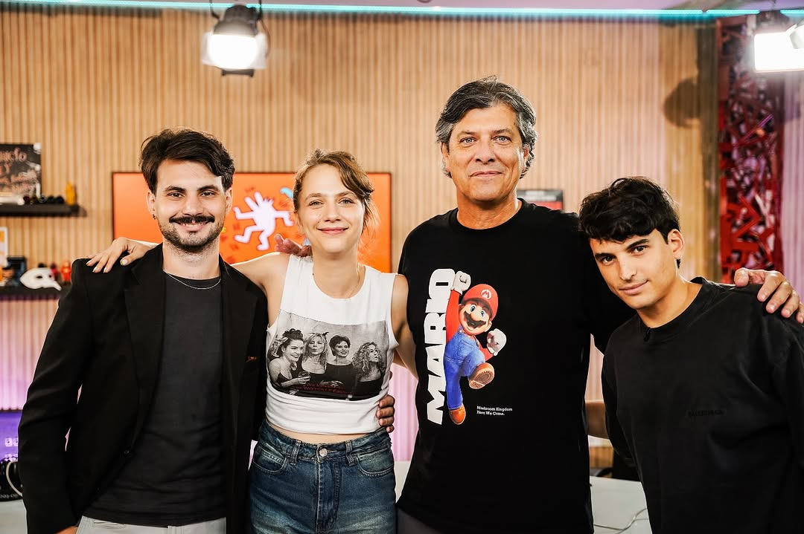

# 🎥 Deja Que Entre el Sol

[](https://github.com/Neymors/deja-que-entre-el-sol/blob/main/LICENSE)
[](https://neymors.github.io/deja-que-entre-el-sol)

**Sitio NO oficial del equipo de streaming y contenido multimedia**  
Un espacio donde la creatividad y el humor se encuentran con la innovación tecnológica.

 <!-- Agrega una captura real del proyecto -->

## 🚀 Características Principales
- ✅ Perfiles interactivos del equipo
- ✅ Galería multimedia con carrusel dinámico
- ✅ Sistema de NecroProde integrado
- ✅ Diseño responsive y mobile-first
- ✅ Modo oscuro/nocturno
- ✅ Animaciones CSS personalizadas
- ✅ Optimizado para SEO

## 👥 Equipo Destacado
| [<br>Mario Pergolini](https://instagram.com/mpergoliniok) | [<br>Goncho Banzas](https://instagram.com/gonchobanzas) | [<br>Cami Fortunato](https://instagram.com/camilafortunatoph) |
|:-----------------------------------------------------------------------------------------------------:|:-----------------------------------------------------------------------------------------------:|:--------------------------------------------------------------------------------------------------------:|
| *Leyenda multimedia*                                                                                  | *Experto en gaming*                                                                             | *Directora creativa*                                                                                     |

| [<br>Juan Tropeano](https://instagram.com/juantropeano) | [<br>Rober Galati](https://instagram.com/robergalati) | [<br>Gerónimo Benabides](https://instagram.com/gero.momo) |
|:---------------------------------------------------------------------------------------------------:|:---------------------------------------------------------------------------------------------:|:---------------------------------------------------------------------------------------------------:|
| *Gurú de redes*                                                                                     | *Especialista en humor*                                                                        | *Boxeador digital*                                                                                 |

## 🛠 Tecnologías Utilizadas
- 
- 
- 
- 

## 🌐 Demo en Vivo
▶️ **[Visitar el sitio](https://neymors.github.io/deja-que-entre-el-sol)**

## ⚙️ Instalación Local
1. Clona el repositorio:
```bash
git clone https://github.com/Neymors/deja-que-entre-el-sol.git
